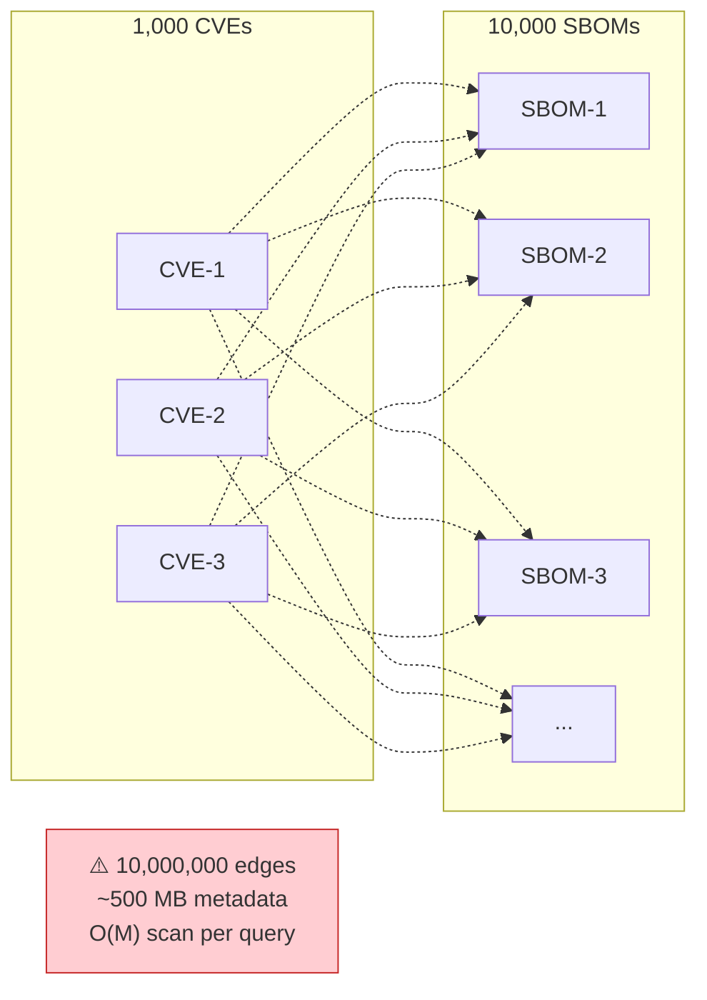
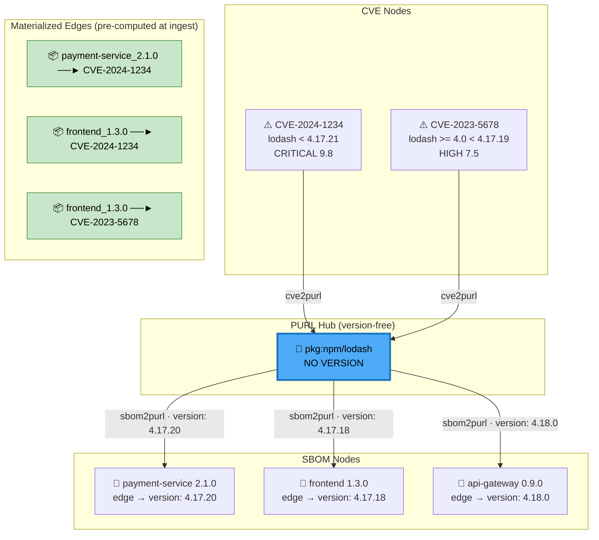
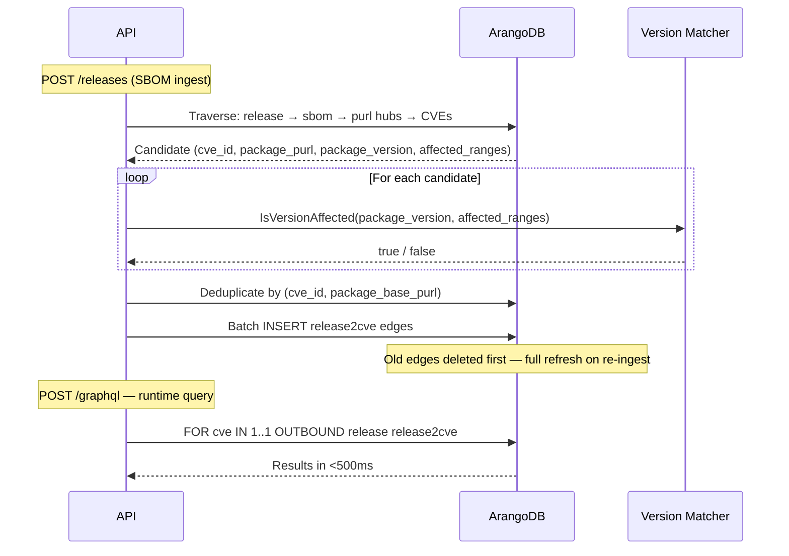

## The Problem: Graph Explosion

The naive approach to connecting vulnerability data with software inventory is to draw a direct edge from every CVE to every SBOM that contains the affected package. This creates an N×M edge problem:

At scale this creates three compounding problems: **storage** (millions of edges with duplicate metadata), **write amplification** (adding one new CVE requires creating thousands of edges), and **query performance** (finding all SBOMs for a CVE requires scanning the entire edge set).

## The Solution: PURL Hub Nodes

Instead of connecting CVEs directly to SBOMs, Ortelius inserts a version-free **PURL hub node** for each unique package. CVEs connect to the hub; SBOMs connect to the hub. Version information lives on the edges, not the nodes.

**Three edge collections do the work:**

| Edge Collection | Direction       | What the edge carries                              |
|-----------------|------------------|-----------------------------------------------------|
| `cve2purl`      | CVE → PURL hub  | Affected version range from OSV                    |
| `sbom2purl`     | SBOM → PURL hub | Exact installed version; semver components         |
| `release2cve`   | Release → CVE   | Package PURL, version — **pre-computed at ingest** |

## Traditional vs Hub-and-Spoke

| Metric                             | Traditional (direct edges) | Hub-and-Spoke            |
|--------------------------------------|-----------------------------|----------------------------|
| Edge count (1K CVEs, 10K SBOMs)    | 10,000,000                 | ~501,000                 |
| Edge storage                       | ~500 MB                    | ~25 MB                   |
| Edge reduction                     | —                          | **99.89%**               |
| Query: CVE → all affected releases | O(M) scan ~30s             | O(K) hub traversal ~3s   |
| Query: release → all CVEs          | O(M) scan ~15s             | Materialized edge <500ms |
| Adding a new CVE                   | 10,000 edge writes         | 1 hub edge write         |

## Materialized `release2cve` Edges

Hub traversal is used once — at SBOM ingest time — to compute which CVEs affect each release. The results are stored as direct `release2cve` edges. All runtime vulnerability queries use these materialized edges rather than traversing the hub graph live.

## Version Matching

Version matching runs at ingest time to decide which candidates become `release2cve` edges, and again at sync time to populate `cve_lifecycle` records (see [Sync Records](../sync-records/)). Both paths use the same `util.IsVersionAffected` function.

Ortelius uses **ecosystem-specific parsers** rather than a single generic semver parser because version schemes differ significantly across package ecosystems:

| Ecosystem                | Parser                         | Example version  |
|----------------------------|-----------------------------------|--------------------|
| npm                      | aquasecurity/go-npm-version    | `4.17.20`        |
| PyPI                     | aquasecurity/go-pep440-version | `2.3.0rc1`       |
| Maven, Go, NuGet, others | Masterminds/semver              | `1.2.3-SNAPSHOT` |
| Fallback                 | String comparison                | any              |

**Key rules that prevent false positives:**

- OSV uses `"0"` in the `introduced` field to mean "from the beginning of time." Ortelius treats this as `0.0.0`, not the literal string `"0"`.
- A range must have **both** a lower bound (`introduced`) **and** an upper bound (`fixed` or `last_affected`) to produce a match. Incomplete ranges return `false`. This prevents a misconfigured or partial OSV record from marking everything as vulnerable.
- Go stdlib versions carrying a `go` prefix (e.g., `go1.22.2`) have the prefix stripped before parsing.

## PURL Standardization

Hub keys must be identical whether they come from a CVE record (OSV data) or an SBOM component (CycloneDX data). Ortelius enforces this through a single function — `util.GetStandardBasePURL()` — that normalizes the ecosystem type and strips the version before generating the hub key.

The most important mapping is the Wolfi/Chainguard family, which OSV lists under ecosystem names that do not match the `apk` PURL type used by SBOM generators:

| OSV Ecosystem  | PURL type used for hub key |
|-----------------|-------------------------------|
| Alpine         | `apk`                      |
| Wolfi          | `apk`                      |
| Chainguard     | `apk`                      |
| Debian, Ubuntu | `deb`                      |
| All others     | lowercased ecosystem name  |

Without this normalization, a CVE for a Wolfi package would create a hub under `pkg:wolfi/...` while the SBOM component creates a hub under `pkg:apk/...` — and the two would never connect.

## Release Ingestion Model

### Deduplication

Releases are deduplicated by the composite key `(name, version, contentsha)` where `contentsha` is populated from `gitcommit` (preferred) or `dockersha`. Uploading the same release twice with the same git commit is a no-op. Uploading with a different git commit creates a new record, even if the name and version are identical — this handles build reproducibility cases.

### SBOM Processing Pipeline

On each `POST /api/v1/releases`:

1. Parse and normalize version into semver components
2. Derive `org` and `shortname` from the `name` field (`org/shortname` format)
3. Hash SBOM content (SHA256) for deduplication
4. Create or retrieve PURL hub nodes (batch upsert)
5. Create `sbom2purl` edges with version metadata
6. Traverse hub graph to find candidate CVEs
7. Validate each candidate with `util.IsVersionAffected` (ecosystem-specific parsers)
8. Batch-insert `release2cve` materialized edges

The same pipeline runs for releases ingested via Kafka (`release.sbom.created` events) — there is no divergence between the REST and event-driven paths. See the [REST API Reference](../rest-api-reference/) for the full endpoint and event schema.
