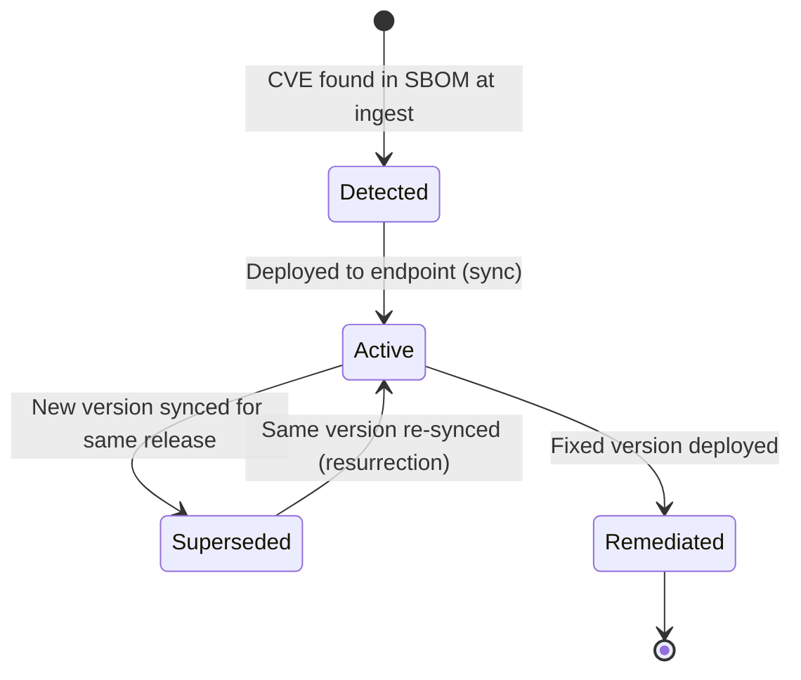

A **sync** record is the act of telling Ortelius what version is currently deployed to an endpoint.

```json
{
  "_key": "sync_prod-us-east-1_1733011200",
  "release_name": "acme/payment-service",
  "release_version": "2.1.0",
  "release_version_major": 2,
  "release_version_minor": 1,
  "release_version_patch": 0,
  "endpoint_name": "prod-us-east-1",
  "synced_at": "2024-12-01T00:00:00Z",
  "objtype": "Sync"
}
```

## Partial Sync Strategy

`POST /api/v1/sync` uses a **partial sweep** model:

1. For each release in the payload, all existing lifecycle records for that `(endpoint, release)` pair are marked `is_remediated: true` with status `Superseded`.
2. CVEs for the new version are fetched from the materialized `release2cve` edges (see [How Ortelius Objects Relate](../how-ortelius-objects-relate/)).
3. Lifecycle records are created or resurrected for each CVE in the new version.
4. Releases **not in the payload are left untouched** — not removed.

## CVE Lifecycle

Each match between a CVE and a deployed release/endpoint is tracked as a `cve_lifecycle` record:

```json
{
  "cve_id": "CVE-2024-1234",
  "endpoint_name": "prod-us-east-1",
  "release_name": "acme/payment-service",
  "introduced_version": "2.1.0",
  "severity_rating": "CRITICAL",
  "introduced_at": "2024-12-01T00:00:00Z",
  "root_introduced_at": "2024-11-01T00:00:00Z",
  "remediated_at": null,
  "is_remediated": false,
  "disclosed_after_deployment": false
}
```



**Root Discovery Tracking**: `root_introduced_at` tracks the earliest time a CVE was first seen for a given `(endpoint, release_name)` pair across version upgrades. MTTR is calculated as `remediated_at − root_introduced_at`, so upgrading from v1 to v2 without fixing a CVE doesn't reset the clock.

**`disclosed_after_deployment`**: set to `true` when `cve.published > root_introduced_at` — these are CVEs that weren't publicly known when the software was first deployed, and are usually the most operationally urgent category. This is what powers the **Post-Deploy CVEs** card on your dashboard — see [Executive Summary Cards](../../../using-ortelius/read-your-dashboard/executive-summary-cards/).
