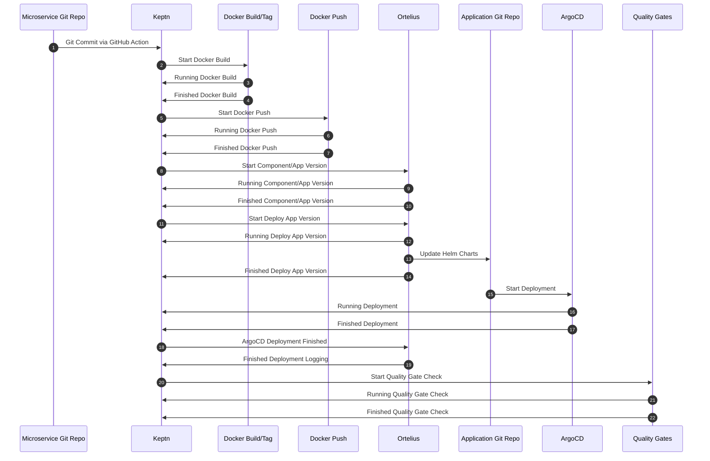

# Ortelius Keptn Event Diagram

1) GitHub Keptn #1 - Utkarsh, Sacha
2) Docker Keptn #2 thru #7 - Steve
3) Ortelius Keptn #8 thru #14 - Steve, Joseph
4) ArgoCD Ketpn #15 thru #19 - Brad, Meha
5) Keptn Quality Gates #20 thru #22 - Brad, Arvind

Reviewer - Tony

Tuesday 8/23 - Discord Check In Status

1. Overall process summary
2. How does the event work?
3. What does the event contain?
4. Security concerns
